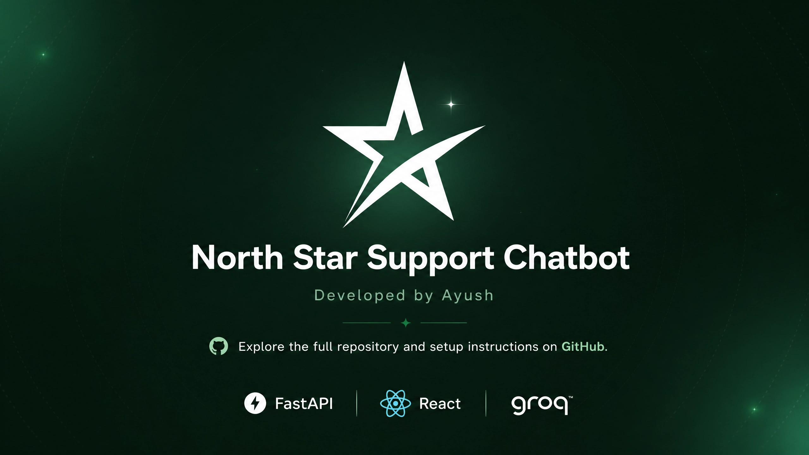
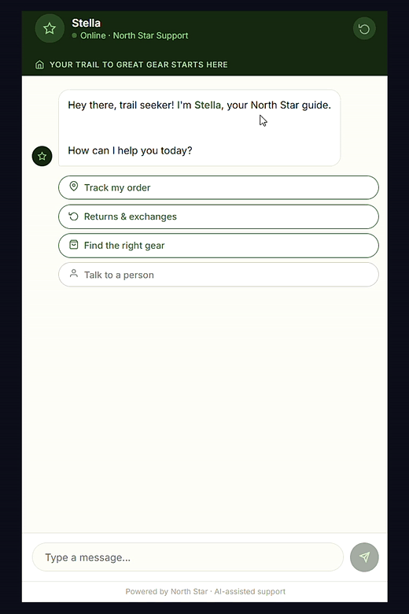
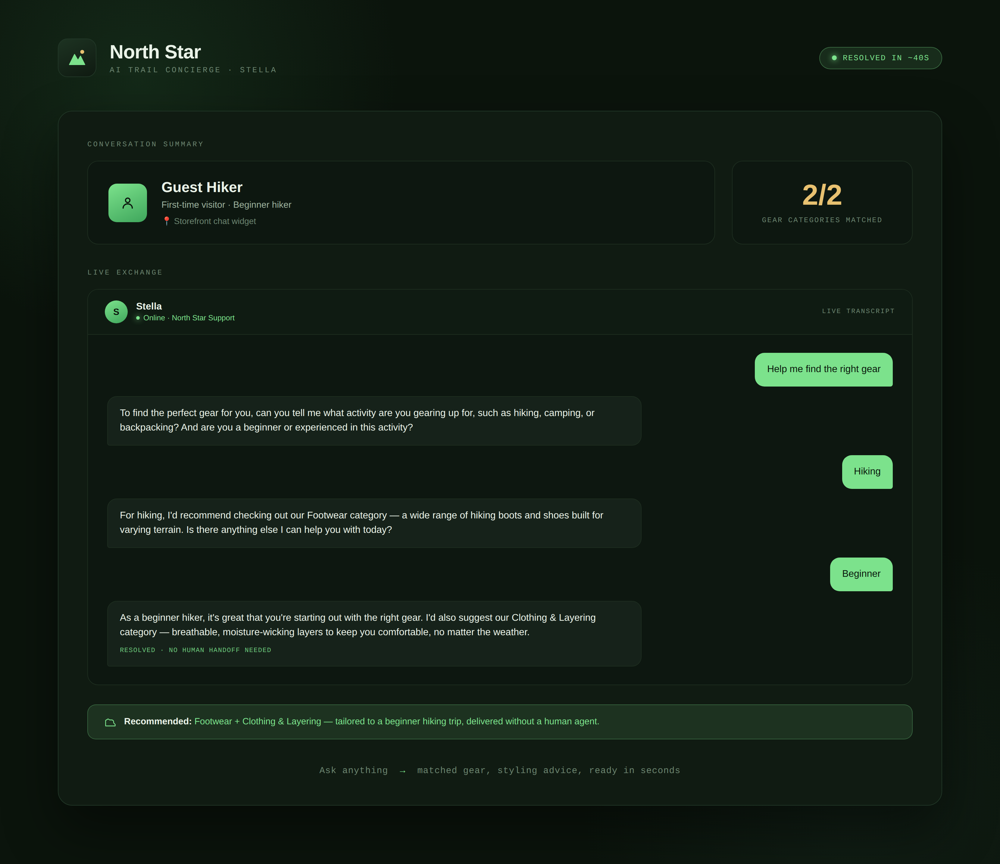

# North Star — AI Customer Support Chatbot


> Paste a message. Get instant, AI-powered customer support — order tracking, returns, product recommendations, and live agent handoff, in seconds.

[Source](https://github.com/ayush-s-tomar/northstar-chatbot) | [LinkedIn](https://www.linkedin.com/in/ayush-s-tomar/)

<p align="center">
  
</p>

### Demo GIF

<p align="center">
  
</p>

### Demo Screenshot

<p align="center">
  
</p>

### Demo Video

https://github.com/user-attachments/assets/b418d176-05c9-449b-9ff2-4a1c6c555221

---

## The Problem

Outdoor gear shoppers need fast, accurate support — but human agents can't be online 24/7, and generic chatbots give robotic, useless responses.

**North Star handles the full support loop, instantly.** Not a canned-response FAQ widget — a conversational AI agent that understands intent, routes intelligently, and responds like a knowledgeable team member.

---

## What It Does

Type a message. The bot ("Stella") detects intent and routes to the right flow automatically:

| Flow | What happens |
|------|--------------|
| Order Tracking | Asks for order number, returns live simulated status |
| Returns & Exchanges | Explains 30-day policy, provides returns link |
| Product Recommendations | Asks 1-2 clarifying questions, recommends the right gear category |
| Human Handoff | Detects frustration or explicit request, transitions to Live Agent state |
| Fallback | Catches anything unrecognized, offers clear options or escalation |

```
User message -> [Intent Detection] -> [Flow Router] -> [Groq LLM Response]
                                          |
              Order / Returns / Recs / Handoff / Fallback
```

---

## Demo

**Order Tracking:**

```
User:   Where is my order?
Stella: Sure! What's your order number?
User:   #111
Stella: Your order is on its way and arriving tomorrow! Is there anything else I can help you with?
```

**Human Handoff:**

```
User:   This is ridiculous, I want a real person
Stella: I'm sorry you're frustrated. Let me connect you with a live agent right away...
        [Live Agent transfer initiated]
```

**Fallback:**

```
User:   asdfghjkl
Stella: I didn't quite catch that! I can help you with order tracking, returns,
        product recommendations, or connect you with our team.
```

### Mock Order Data

| Order # | Status | Detail |
|---------|--------|--------|
| `#111` | Shipped | Arriving tomorrow |
| `#222` | Processing | Ships within 24 hours |
| `#333` | Delivered | Bot asks if issue needs resolving |
| Any other | Not found | Prompts user to check the number |

---

## Tech Stack

| Layer | Technology |
|-------|-----------|
| Backend | FastAPI (Python) |
| AI / NLU | Groq API — Llama 3.3 70B |
| Frontend | React 18 |
| Styling | CSS-in-JS (zero dependencies) |
| API Key | Groq free tier — no cost, fast inference |
| CI | GitHub Actions (lint, format, import check, build) |

---

## Conversation Flows (Detail)

**Intent recognition** handles natural variations automatically:

- "Where is my order?" / "Track my package" / "Order status" -> Order Tracking
- "I want to return this" / "Exchange policy" / "Send it back" -> Returns
- "What should I buy?" / "Gear recommendations" / "Help me find a tent" -> Product Recs
- "Speak to a human" / "This is frustrating" / "Real person" -> Human Handoff

**Shipping policy (built-in):** Standard 3-5 business days, Expedited 1-2 business days.

**Return policy (built-in):** 30-day returns, unused items, original packaging required.

---

## Project Structure

```
northstar-chatbot/
├── .github/
│   └── workflows/
│       └── ci.yml             # Lint + format + import + build checks
├── backend/
│   ├── main.py                # FastAPI app - intent detection + all 5 chat flows
│   ├── requirements.txt
│   └── .env.example
├── frontend/
│   ├── src/
│   │   ├── App.js             # React chat UI - Stella persona, quick-reply buttons,
│   │   │                       # order cards, animations
│   │   └── index.js
│   └── public/
│       └── index.html
├── docs/
│   ├── northstar-brand.png    # Brand/outro card
│   ├── demo.gif                # Short walkthrough gif
│   └── demo-screenshot.png    # Static UI screenshot
├── .gitignore
├── LICENSE
└── README.md
```

---

## Run Locally

```bash
# 1. Clone
git clone https://github.com/ayush-s-tomar/northstar-chatbot.git
cd northstar-chatbot

# 2. Backend
cd backend
py -3.11 -m pip install -r requirements.txt
cp .env.example .env
# Paste your Groq API key into .env - free key at https://console.groq.com
py -3.11 -m uvicorn main:app --reload --port 8000
# -> http://localhost:8000/docs

# 3. Frontend (new terminal)
cd ../frontend
npm install
npm start
# -> http://localhost:3000
```

**Environment variables** (`backend/.env`):

```
GROQ_API_KEY=your_groq_api_key_here
```

---

## Known Limitations

- **Not deployed.** This is currently a local-run portfolio project - no live demo link. Order data, returns, and recommendations are all mocked/simulated rather than backed by a real store or CRM.
- **No persistent conversation memory** - each session starts fresh; the bot doesn't recall prior conversations or link them to a real customer account.
- **No authentication layer** - single-session demo, not multi-tenant.
- **Order lookup is a fixed mock table** (`#111`, `#222`, `#333`) rather than a real order management system.

---

## What I'd Add Next

- **Deploy** backend to Render and frontend to Vercel/Streamlit for a live demo link
- **User authentication** - link order numbers to real accounts
- **WebSocket streaming** - token-by-token response like ChatGPT
- **Conversation memory** - remember context across sessions
- **Analytics dashboard** - track which flows are hit most, drop-off points
- **Multi-language support** - serve North American + international customers

---

## License

MIT - see [LICENSE](LICENSE).

---

*Part of my AI developer portfolio - agents that do real, autonomous work, not chatbots with a prompt. See also: [SalesAgent](https://github.com/ayush-s-tomar/salesagent), an autonomous B2B lead research and outreach agent.*